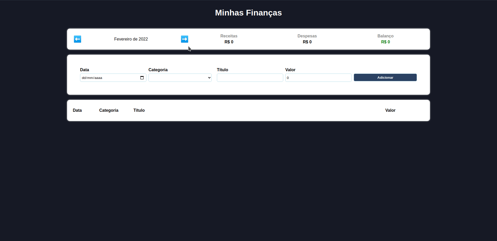

# <div align="center">My Finances</div>


<br>
<br>

## Sobre
<p>
    Aplicação para gestão de finanças. Com ela é possível adicionar os gastos e ganhos do mês, tendo uma melhor visualização das suas receitas e despesas,<br>
    além de obter o balanço geral, para saber se ficou no lucro ou no prejuízo.
</p>

## 🛠️ Tecnologias

<ul>
  <li><a href="https://reactjs.org/">React</a></li>
  <li><a href="https://nodejs.org/en/">Node</a></li>
</ul>

## ⚙️ Requisitos

<ul>
  <li><a href="https://git-scm.com/">Git</a></li>
  <li><a href="https://nodejs.org/en/">Node.js</a></li>
  <li><a href="https://www.npmjs.com/">NPM</a></li>
</ul>

## 🚀 Instalação

```
$ git clone https://github.com/jeffersonximeness/my-finances.git
$ cd my-finances
$ npm install
$ npm start
```

<p>A aplicação irá abrir localmente em <strong>http://localhost:3000</strong></p>